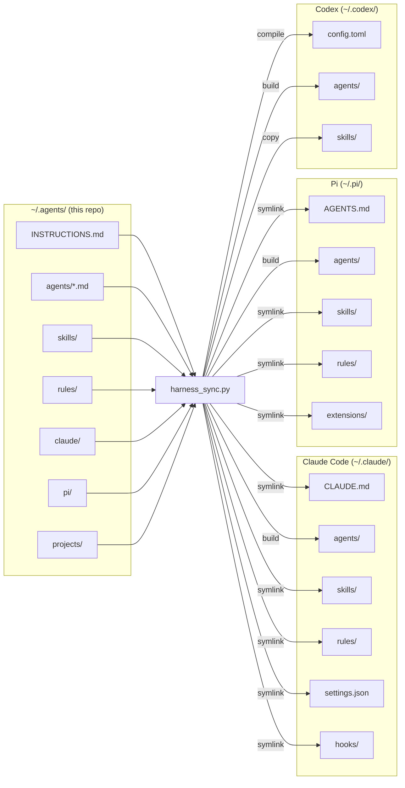

# dot-agents

Harness-agnostic registry for agent and skill definitions. Author once, deploy
to [Claude Code](https://claude.ai/code),
[Pi](https://github.com/badlogic/pi-mono), and
[Codex](https://github.com/openai/codex).

Nothing here is read directly by any harness at runtime. Run `harness_sync.py`
to compile and deploy.



## Quick Start

```bash
# 1. Clone to ~/.agents (the sync script expects this location)
git clone <this-repo> ~/.agents

# 2. Install the only dependency
pip install pyyaml

# 3. Deploy everything (first run: use --force to replace existing files)
python3 ~/.agents/scripts/harness_sync.py --force

# 4. After editing agents, skills, or rules:
python3 ~/.agents/scripts/harness_sync.py
```

## Structure

```
INSTRUCTIONS.md      global user instructions (deploys as CLAUDE.md / AGENTS.md)
agents/              .md files with YAML frontmatter (one per agent)
skills/              directory per skill (SKILL.md + optional scripts/, references/, assets/)
rules/               shared prose rules (.md files)
claude/              Claude Code config (settings.json, settings.local.json, hooks/)
pi/                  Pi config (settings.json, mcp.json, extensions/)
projects/
  main.yml           maps project names -> per-machine filesystem paths
  <project>/         per-project overrides:
    INSTRUCTIONS.md  project instructions
    agents/          project agents (canonical format)
    skills/          project skills (SKILL.md directories)
    rules/           project-specific rules
    claude/          project Claude config (settings.local.json, hooks/)
scripts/
  harness_sync.py    compiles this repo -> ~/.claude/, ~/.pi/, ~/.codex/
```

Each directory has its own README with detailed format documentation.

## Usage

```bash
# deploy everything
python3 ~/.agents/scripts/harness_sync.py

# create a new agent (copy the template, fill in what you need)
cp ~/.agents/agents/agent-template.md ~/.agents/agents/my-agent.md

# create a new skill
mkdir -p ~/.agents/skills/my-skill
# write ~/.agents/skills/my-skill/SKILL.md

# deploy after changes
python3 ~/.agents/scripts/harness_sync.py

# force deploy (replaces existing files/dirs that block symlinks)
python3 ~/.agents/scripts/harness_sync.py --force

# clean deploy (also removes unmanaged files from deploy targets)
python3 ~/.agents/scripts/harness_sync.py --force --clean
```

## What the sync does

### Global assets

| Source | Claude Code | Pi | Codex |
|--------|------------|-----|-------|
| `INSTRUCTIONS.md` | symlink -> `~/.claude/CLAUDE.md` | symlink -> `~/.pi/agent/AGENTS.md` | compiled into `~/.codex/config.toml` |
| `agents/*.md` | built -> `~/.claude/agents/<name>.md` | built -> `~/.pi/agent/agents/<name>.md` | built -> `~/.codex/agents/<name>.toml` |
| `skills/` | symlink (whole dir) -> `~/.claude/skills/` | symlink -> `~/.pi/agent/skills/` | copy -> `~/.codex/skills/` |
| `rules/` | symlink (whole dir) -> `~/.claude/rules/` | symlink -> `~/.pi/agent/rules/` | compiled into `~/.codex/config.toml` |
| `claude/` | symlinks: `settings.json`, `settings.local.json`, `hooks/`, `.mcp.json` -> `~/.claude/` | -- | -- |
| `pi/` | -- | symlinks per item -> `~/.pi/agent/<item>` (except `extensions-optional/` -> `~/.pi/`) | -- |

### Project assets

`projects/main.yml` maps project names to filesystem paths per machine.
The sync script detects the current machine via hostname and only deploys
projects that have a path for that machine.

For each project with a subdirectory at `projects/<name>/`:

| Source | Claude Code | Pi | Codex |
|--------|------------|-----|-------|
| `INSTRUCTIONS.md` | symlink -> `<path>/CLAUDE.md` | symlink -> `<path>/AGENTS.md` | compiled into `<path>/.codex/config.toml` |
| `agents/*.md` | built -> `<path>/.claude/agents/<name>.md` | built -> `<path>/.pi/agents/<name>.md` | built -> `<path>/.codex/agents/<name>.toml` |
| `skills/<skill>/` | symlink per skill -> `<path>/.claude/skills/<skill>` | symlink -> `<path>/.pi/skills/<skill>` | copy -> `<path>/.codex/skills/<skill>` |
| `rules/` | symlink -> `<path>/.claude/rules/` | symlink -> `<path>/.pi/rules/` | compiled (global + project rules) into `<path>/.codex/config.toml` |
| `claude/settings.local.json` | symlink -> `<path>/.claude/settings.local.json` | -- | -- |
| `claude/hooks/` | symlink -> `<path>/.claude/hooks/` | -- | -- |

### Deployment mechanics

- **Symlink** -- source edits take effect immediately, no re-sync needed.
- **Built** -- agents are transformed per harness (harness-specific frontmatter fields extracted, different output format). Re-sync required after editing.
- **Compiled** -- Codex has no directory-based rule loading, so instructions and rules are concatenated into the `instructions` key of `config.toml` between markers. Re-sync required after editing.
- **Copy** -- Codex skills are copied (not symlinked) because Codex writes its own `.system/` directory into the skills folder. Copying isolates the canonical source from Codex mutations. Re-sync required after editing.

Agent files named `agent-template` and `README` are always skipped.
Unmanaged files in deploy targets are flagged but not deleted (use `--clean` to delete).

## Customization

### Machine detection

Edit `_detect_machine()` in `scripts/harness_sync.py` to map your hostnames
to short machine names. These names must match the keys in `projects/main.yml`.

### Adding a project

1. Add a mapping in `projects/main.yml`:
   ```yaml
   my-project:
     laptop: /home/user/projects/my-project
     server: /opt/projects/my-project
   ```
2. Optionally create `projects/my-project/` with project-specific overrides
3. Run `python3 ~/.agents/scripts/harness_sync.py`

### Harness-specific config

- Claude Code settings: `claude/settings.json`, `claude/settings.local.json`
- Claude Code hooks: `claude/hooks/`
- Pi settings: `pi/settings.json`, `pi/mcp.json`
- Pi extensions: `pi/extensions/`
