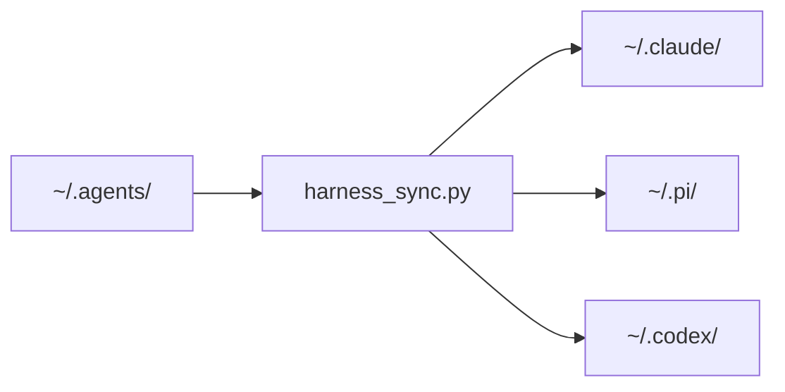

# dot-agents

Harness-agnostic registry for agent and skill definitions. Author once, deploy
to [Claude Code](https://claude.ai/code),
[Pi](https://github.com/badlogic/pi-mono), and
[Codex](https://github.com/openai/codex).

Nothing here is read directly by any harness at runtime. Run `harness_sync.py`
to compile and deploy.



## Install

```bash
git clone <this-repo> ~/.agents
pip install pyyaml
python3 ~/.agents/scripts/harness_sync.py --force
```

## Edit, sync, repeat

```bash
# edit anything in ~/.agents/, then:
python3 ~/.agents/scripts/harness_sync.py
```

Symlinked assets (skills, rules, config) take effect immediately — re-sync
is only needed after editing agents.

## Structure

```
~/.agents/
├── INSTRUCTIONS.md        global user instructions
├── agents/                one .md per agent (YAML frontmatter + prompt)
├── skills/                one directory per skill (SKILL.md + scripts/)
├── rules/                 shared rules (.md files, no frontmatter)
├── claude/                Claude Code config (settings, hooks)
├── pi/                    Pi config (settings, extensions)
├── projects/
│   ├── main.yml           project name -> filesystem path per machine
│   └── <project>/         project-specific agents, skills, rules, hooks
└── scripts/
    └── harness_sync.py
```

Each directory has its own README with format details.

## Flags

| Flag | Effect |
|------|--------|
| `--force` | Replace existing files with symlinks |
| `--clean` | Delete unmanaged files from deploy targets |
